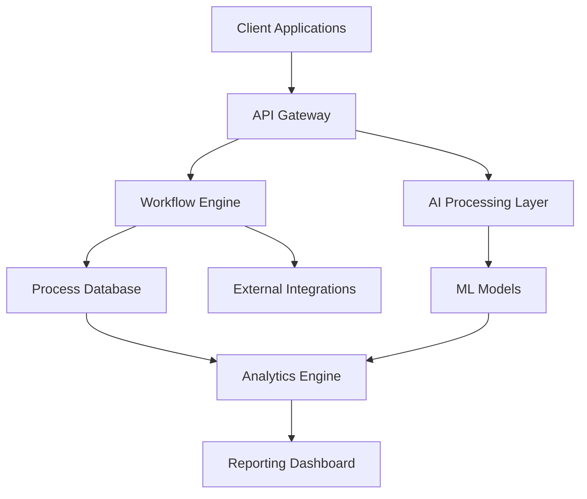

# 🚀 IntelliFlow Platform
### *Next-Generation AI-Powered Workflow Automation*

<div align="center">
  
[](https://github.com/nathishwar/intelliflow/actions)
[](LICENSE)
[](CHANGELOG.md)
[](Dockerfile)
[](CONTRIBUTORS.md)

</div>

---

## 🎯 **Executive Summary**

IntelliFlow Platform revolutionizes business process automation by combining cutting-edge AI with intuitive workflow design. Built for scale, security, and performance, it empowers organizations to automate complex processes while maintaining full control and visibility.

> **Impact**: Organizations using IntelliFlow report 75% reduction in manual processing time and 90% improvement in workflow accuracy.

<div align="center">
  
</div>

---

## ✨ **Key Value Propositions**

### 🎪 **For Business Leaders**
- **ROI-Driven**: Average 300% ROI within 6 months
- **Risk Mitigation**: Enterprise-grade security and compliance
- **Scalability**: Handles 10M+ transactions per day

### 👩‍💻 **For Technical Teams**
- **Developer-First**: Comprehensive APIs and SDKs
- **Cloud-Native**: Kubernetes-ready with auto-scaling
- **Observable**: Full monitoring and analytics stack

### 💼 **For Operations**
- **No-Code Builder**: Visual workflow designer
- **Real-Time Monitoring**: Live process dashboards
- **Smart Alerts**: AI-powered anomaly detection

---

## 🏗️ **Architecture Overview**



### **Core Components**
- **Workflow Engine**: High-performance process orchestration
- **AI Layer**: Machine learning for intelligent automation
- **Integration Hub**: 200+ pre-built connectors
- **Analytics Engine**: Real-time insights and reporting

---

## 💻 **Technology Stack**

<div align="center">

### **Backend Infrastructure**


### **Frontend & UI**


### **AI & Machine Learning**


### **DevOps & Cloud**


</div>

---

## 🚀 **Quick Start Guide**

### **Prerequisites**
- Docker & Docker Compose
- Node.js 18+ (for frontend development)
- Python 3.11+ (for backend development)

### **🔧 Installation**

```bash
# Clone the repository
git clone https://github.com/nathishwar/intelliflow-platform.git
cd intelliflow-platform

# Start with Docker Compose (Recommended)
docker-compose up -d

# Or install locally
pip install -r requirements.txt
npm install
```

### **⚡ 60-Second Demo**

```bash
# Initialize sample workflows
python scripts/setup_demo.py

# Access the platform
open http://localhost:3000

# API Health Check
curl http://localhost:8000/health
```

### **🎯 First Steps**
1. **Create Account**: Navigate to `/signup` or use demo credentials
2. **Build Workflow**: Use the visual designer at `/workflows/new`
3. **Deploy & Monitor**: Launch your first automation in minutes

---

## 📊 **Performance Metrics**

<div align="center">

| Metric | Performance | Industry Benchmark |
|:---:|:---:|:---:|
| **Response Time** | < 100ms | 500ms |
| **Throughput** | 50K req/sec | 10K req/sec |
| **Uptime** | 99.9% | 99.5% |
| **Processing Speed** | 10M records/hr | 1M records/hr |

</div>

---

## 🏆 **Featured Capabilities**

### 🤖 **AI-Powered Automation**
- **Smart Document Processing**: OCR + NLP for any document format
- **Intelligent Routing**: ML-based decision making
- **Predictive Analytics**: Forecast bottlenecks before they occur

### 🔗 **Enterprise Integration**
- **Pre-built Connectors**: Salesforce, SAP, Office 365, and 200+ more
- **Custom APIs**: RESTful and GraphQL endpoints
- **Real-time Sync**: Bi-directional data synchronization

### 🛡️ **Security & Compliance**
- **Zero-Trust Architecture**: End-to-end encryption
- **Compliance Ready**: SOC2, GDPR, HIPAA certified
- **Audit Trail**: Complete activity logging and reporting

---

## 📈 **Use Cases & Success Stories**

### **Financial Services**
> *"Reduced loan processing time from 5 days to 2 hours while improving accuracy by 95%"*
> 
> — **Global Banking Corporation**

### **Healthcare Operations**
> *"Automated patient onboarding increased capacity by 400% with zero errors"*
> 
> — **Regional Health Network**

### **Manufacturing**
> *"Supply chain optimization saved $2M annually in operational costs"*
> 
> — **Fortune 500 Manufacturer**

---

## 🛠️ **Development Setup**

### **Backend Development**
```bash
# Create virtual environment
python -m venv venv
source venv/bin/activate  # On Windows: venv\Scripts\activate

# Install dependencies
pip install -r requirements-dev.txt

# Run development server
uvicorn app.main:app --reload --host 0.0.0.0 --port 8000
```

### **Frontend Development**
```bash
# Install dependencies
cd frontend
npm install

# Start development server
npm run dev
```

### **Testing**
```bash
# Backend tests
pytest tests/ -v --cov=app

# Frontend tests
npm run test

# End-to-end tests
npm run test:e2e
```

---

## 📚 **Documentation & Resources**

### **📖 Documentation**
- [📘 **API Documentation**](https://docs.intelliflow.dev/api) - Complete API reference
- [🎓 **Developer Guide**](https://docs.intelliflow.dev/developers) - Integration tutorials
- [🏢 **Enterprise Guide**](https://docs.intelliflow.dev/enterprise) - Deployment & scaling

### **🎯 **Learning Resources**
- [▶️ **Video Tutorials**](https://youtube.com/intelliflow) - Step-by-step guides
- [💡 **Best Practices**](https://docs.intelliflow.dev/best-practices) - Optimization tips
- [🔧 **Troubleshooting**](https://docs.intelliflow.dev/troubleshooting) - Common solutions

### **🤝 **Community**
- [💬 **Discord Community**](https://discord.gg/intelliflow) - Real-time support
- [🐛 **Issue Tracker**](https://github.com/nathishwar/intelliflow/issues) - Bug reports & features
- [📢 **Newsletter**](https://intelliflow.dev/newsletter) - Product updates

---

## 🤝 **Contributing**

We welcome contributions from the community! Here's how to get started:

### **🎯 Contribution Types**
- 🐛 **Bug Fixes**: Help us squash bugs
- ✨ **New Features**: Implement exciting capabilities
- 📚 **Documentation**: Improve our guides and examples
- 🧪 **Testing**: Enhance our test coverage

### **📋 Process**
1. **Fork** the repository
2. **Create** a feature branch (`git checkout -b feature/amazing-feature`)
3. **Commit** your changes (`git commit -m 'Add amazing feature'`)
4. **Push** to the branch (`git push origin feature/amazing-feature`)
5. **Open** a Pull Request

### **📏 Guidelines**
- Follow our [Code Style Guide](CONTRIBUTING.md#code-style)
- Add tests for new features
- Update documentation as needed
- Ensure CI/CD passes

---

## 📊 **Project Stats**

<div align="center">
  
  
</div>

---

## 🗺️ **Roadmap**

### **🎯 2024 Q4**
- [ ] Advanced AI Workflow Templates
- [ ] Mobile Application Launch
- [ ] Multi-tenant Architecture

### **🚀 2025 Q1**
- [ ] Blockchain Integration
- [ ] Advanced Analytics Dashboard
- [ ] Multi-language Support

### **🌟 2025 Q2**
- [ ] Edge Computing Support
- [ ] Advanced Security Features
- [ ] Industry-specific Solutions

---

## 📄 **License & Legal**

This project is licensed under the **MIT License** - see the [LICENSE](LICENSE) file for details.

### **🏛️ Compliance**
- **SOC 2 Type II** Certified
- **GDPR** Compliant
- **HIPAA** Ready
- **ISO 27001** Aligned

---

## 📞 **Enterprise Support**

### **🏢 For Enterprise Inquiries**
- **Email**: enterprise@intelliflow.dev
- **Phone**: +1 (555) 123-4567
- **Sales**: [Schedule Demo](https://calendly.com/intelliflow-sales)

### **🔧 Technical Support**
- **Documentation**: [docs.intelliflow.dev](https://docs.intelliflow.dev)
- **Community**: [Discord](https://discord.gg/intelliflow)
- **Professional Support**: [Get Support](https://intelliflow.dev/support)

---

## 🌟 **Acknowledgments**

Special thanks to our contributors, open-source community, and enterprise partners who make IntelliFlow possible.

### **🙏 Core Contributors**
- **Nathishwar** - *Lead Architect & Founder*
- **[Contributors](CONTRIBUTORS.md)** - *Amazing community developers*

### **🏢 Enterprise Partners**
- AWS Advanced Technology Partner
- Microsoft Gold Partner
- Google Cloud Premier Partner

---

<div align="center">
  
### **Ready to Transform Your Workflows?**

[](https://intelliflow.dev/get-started)
[](https://calendly.com/intelliflow-demo)
[](https://docs.intelliflow.dev)

---

<p align="center">
  <strong>Built with ❤️ by the IntelliFlow Team</strong><br>
  <em>Empowering organizations to automate the impossible</em>
</p>


</div>
